## Abstract

As the demand for navigation access increases so does the improvement of software development, more and more navigation tools have been created for efficient life among cities. This project is to create a new navigation toolbox based on ArcGIS by python scripts to provide users shortest route information among two arbitrary places among the city of Vancouver. The input are citizens addresses ID or names of different places with their types and results can offer users detailed navigation including street names, travelling distances and positions of street intersections. Key word: navigation; shortest route; Dijskra’s algorithm.

## Introduction

Nowadays, navigation plays a more and more significant role in urban city life especially in some big cities. It has totally replaced traditional maps for users to find a location or select an optimal route among cities in our daily life. In this project, a navigation toolbox has been created containing four functions in city of Vancouver based on geographic information system(GIS). Users can use this toolbox to easily find nearest or specified school, library or school from home among Vancouver, get shortest a route between two properties and obtain a shortest path between two given different places. It will show users detailed information in navigation which contains street names, street lengths and positions of intersections. The motivation of undertaking the research is from daily life. Every time when I use Google map, I notice it is an essential software among people and wonder if there is possible to make a navigation software like that by myself. GIS provides XY coordinates and some attributes of every object in Vancouver, relationships among different objects can be found and spatial positions with geographic references are reliable to analyze to create new toolbox. The general solution for navigation in this project is to locate start and end points first, then choose network area covering these two points and last analyze this network area to provide an optimal path. In the rest of this report, it will illustrate data collection, flowchart of solution, details in network area analysis which is how to find an optimal path and Dijsktra’s algorithm applied in shortest route calculation.

## Literature Review

In this section of report, it provides previous research with new ideas and changes to current research, core algorithm used in project, how algorithm be applied into project and algorithm improvements.

### Previous Work Review

In previous work, UNA toolbox from MIT City Form Lab is used to solve the shortest route problem and it can get the shortest path easily just by input start and end data. However, a new idea came to my mind is to create a navigation toolbox by myself which can calculate the shortest path among the whole Vancouver city network based on Dijkstra’s algorithm.

### General steps of Dijkstra’s Algorithm

Dijkstra’s algorithm is an advanced version of greedy algorithm for finding the shortest path between nodes in a graph. Dijkstra, E. W. (1959) first found there was an approach to construct the tree of minimum total length between the n nodes and find the path of minimum total length between two given nodes to get a shortest path. The general steps of this approach can be concluded in six step: 1. Mark all unvisited nodes and create a set containing all unvisited nodes. 2. Set initial node value 0 as current node and assign every node a tentative distance value. 3. Calculate the distance between current node and all its neighbour nodes to get the shortest tentative distance and mark it. 4. Once checking all neighbour nodes of current node, mark current node which we have visited and remove it from the set we generated in step one. 5. When the shortest tentative distance is infinity or it has come to the final unvisited node, Dijkstra’s algorithm has finished. 6. If it does not come to the end, select the unvisited node with shortest distance as current node and go back to step three.

### Similarities and Differences with Approaches

For similarities, Dijkstra’s algorithm provides a mathematical solution for finding a shortest path among a weighted graph and the project purpose is also to yield a shortest route among the city network. However, Dijkstra’s algorithm can not be used directly among city network and there is a model need to be created for application.

### Apply Dijkstra’s Algorithm into City Network

Building city network for Dijkstra’s algorithm to use is to create a weighted graph based on street intersections where street intersections represent for nodes in graph and different street lengths between two nodes represent for corresponding distances between two intersections. Due to the large data set consisted of whole intersections and streets in Vancouver should be processed, there is impossible to store all data and use Dijkstra’s algorithm to calculate a shortest path among the whole city. What has been done is to find a particular area covering start and end points and then perform calculation in this specific area which can save plenty of time and storage space.

### Improvement of Dijkstra’s Algorithm

In DongKai Fan and Ping Shi (2010) research, they improved storage structure and searching area algorithm which are two drawbacks of classical Dijkstra’s algorithm. Their algorithm appended analysis of space complexity and analysis of time complexity for storage structure and set restricted search area when finding next node during route calculation. It is possible to create an advanced version of Dijkstra’s Algorithm in this project to select searching area in finding network regions among the city and store processed topological relationships by deleting some unnecessary intersections.

## Study Area Description

Study area in this project is the city of Vancouver. It contains 17013 public streets, 6092 street intersections, 100851 property addresses, 264 parks, 194 schools and 21 libraries and all of these data mentioned are analyzed in the project. For other data such as non city streets, lines, city projects sites, traffic signals and so on are added to consist of the final map but these data are not processed.


## Description of Datasets & Data Preprocessing

This section will outline the table listing of input data sets and attributes of data set used in analysis, data collecting, development of geodatabase, data checking and preprocessing.

### Listing Table of Input Data

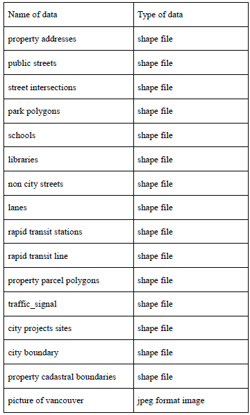

### Listing Table of Data for Spatial Analysis

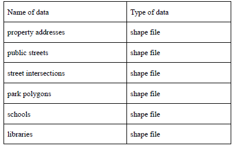

### Listing Table of Attributes for Spatial Analysis


### Data Collecting and Geodatabase Development

All data mentioned are downloaded directly from the website established by the government of Vancouver. Once these data are ready to use, a new layer is created in ArcMap to project these data. Then a file geodatabase is created to store selected shape files.

### Data Checking and Preprocessing

After finishing building map, checking attribute data of these shape files makes sure data ready to use are reliable. For error and blank in data attribute, the best way is to find information online then fill and correct them. After checking data attribute, it shows data are almost good expect for one problem that the designer got some errors when digitizing public_street shape file. Some of streets are separated in this shape file which means some streets may contain more than two points(two points refer to start point and end point consisted of a whole street). As for data preprocessing, it is necessary to join these separated streets with the same street name into a whole street then store these street information into one list for next operations. What has been solved is to store all streets with street name and XY coordinates into a list first, then process these streets with same street names, join XY coordinates of these streets having the same street name together to update a new street connecting separated information and then delete repeating elements.

## Methodology

This section covers a flowchart of solution, an introduction to created functions, a detailed description including seven steps of spatial analysis methods and explanations of core python scripts.

### Flowchart of Solution


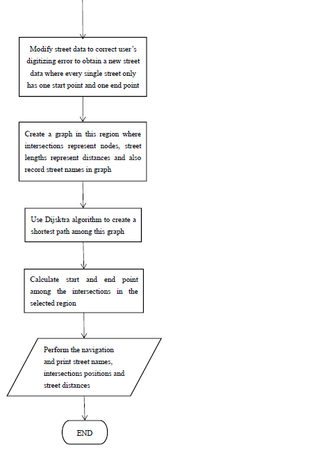

### List of Created Functions

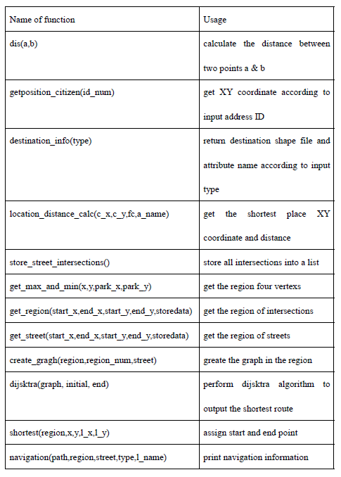

### Detailed Description of Methods

Step 1: Store street intersections

Street intersections are consisted of the whole city network so the first thing is to store intersections attributes from shape file into an array. A three dimensional list called ‘data’ has been created containing three attributes which are feature ID of intersections and their X Y coordinates separately. From the for loop, the range is 6970 which means there are 6970 intersections in Vancouver and these intersections information have been stored in list ‘data’. For spatial data analysis, it is not wise to process all intersections because it may cost a long time. Next section will illustrate how to select specific region containing few intersections according to users input data to reduce unnecessary process, the selected region of streets and details of operations.

Step 2: Collect necessary spatial data from input

According to input user address ID, it is efficient to use a search cursor in address shape file and easily get XY coordinate from FID. A part of property_addresses attribute table and function are below:


Due to the name domain in park is different from other two so we must use ‘if’ to select feature names. After this process, it can get the nearest place to user address. For example, if the user want to go to nearest park, for every park in our map, it contains its own XY coordinate. A part of of park_polygons attribute table is below:

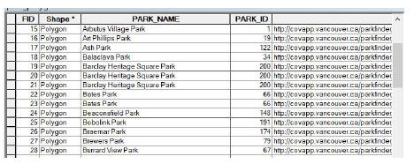

Then a search cursor can be used for every single park to calculate the absolute distance between every park (x1,x2) and user’s home (x2,y2) and then output the nearest one’s XY coordinate and name. For school and library, there are the same as park. So far, we have start point XY coordinate and destination XY coordinate with names.

Step 3: Select region which should be analyzed from the map

This step is to avoid unnecessary processes because it need not always compute all intersections and streets data in Vancouver which may causes few minutes even Topic in GIS & Geoprocessing Final Project Report 15 few hours. Therefore, a selected region should be assigned. For example, there are start point which is the red triangle and end point which is green rectangle in Figure 3. The original region is light red rectangle and processed region is dark rectangle after adding boundary for original region to make sure all intersections which may affect route calculation are covered. The minimum distance for boundary is 600 meters which has been tested for this number covering routes between all addresses and selected places.

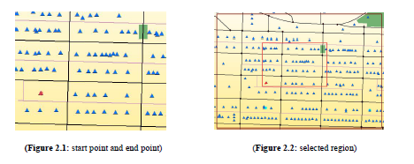

The next process is to store all intersections in this region into one list and all streets in this region into another list. Because there already exists a list containing all 6970 intersections in data preprocessing, so this process just need to clip some of them from the whole intersections data set into a new list. When it comes to streets storing, it needs some operations to solve maker’s error in public street shape file. The purpose is to connect separated streets into a whole street. Function get_street below can both store streets data and process separated streets connections.

Step 4: Create graph

For every intersection in the region, distances between every single intersection need to be created and then output the graph which is a three-dimensional list containing one start node, one end node and the distance between them. Function create_graph can yield the graph by input street intersections and streets in the selected region.

Step 5: Use Dijsktra algorithm to output the shortest route

In this section, scripts are from open source code online and have been some changes to be adapt to the whole project. In create_gragh function, the return data fromat has changed to [node1, node2, distance] to match input format in dijsktra algorithm function. The result of this function is a shortest route containing all passing nodes which is a list consisted of different pairs of intersection to intersection.

Step 6: Print navigation output

After getting the shortest path, it can print navigation information for users. Function navigation can show street names, street lengths and intersection positions. Due to the shortest path output does not contain street names only has intersections ID, the first two loops are to find XY coordinate of two intersections according to their ID. Then the next loop is to find the street which contains these two intersections. Then it can print street name and the distance how long users should go. In Canada, straight roads are classified into roads with same name without different numbers in front of them. So parameters ‘turn’ and ‘origin’ in this function are used to mark if the main street name has changed which means there is no longer straight road in there and then it can remind users may make a turn at the intersection.

Step 7: Create toolbox

Based on this script, there are some changes have been added and the project finally yields four different tools for users: 1. property addresses navigation which can provide navigation information from one property address to another address; 2. shortest route navigation which is from one property address to nearest park, school or library; 3. specified destination navigation gives users a path from property address to specific park, school or library; 4. two given places navigation offers a shortest route from one place to another place among parks, libraries and schools.

## Results and Discussion

This section will illustrate two parts: the map created by ArcMap and results of navigation information for four different tools.

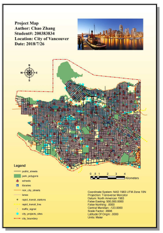
The created map contains some of shape files such as public streets, park polygons, schools, libraries and so on in order to illustrate the view of whole city. It also includes some other data like rapid transit line with its stations because it plays an important role in city traffic though they have not been analyzed. For street intersections and property addresses, they are not included in the map because the large number of them may cause the whole map unclear to see and it is unnecessary for users to see these data but they are mainly processed by python scripts to create the navigation toolbox.

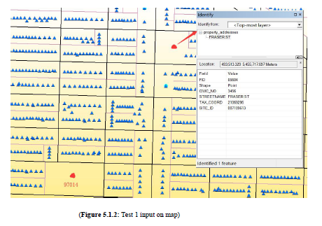
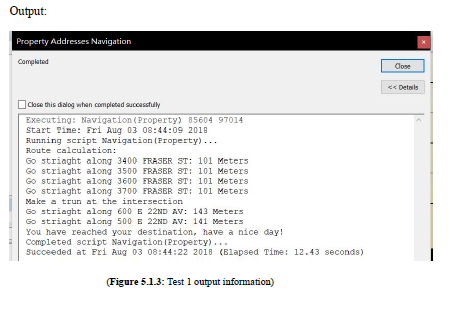
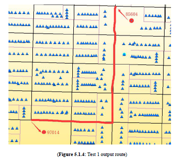
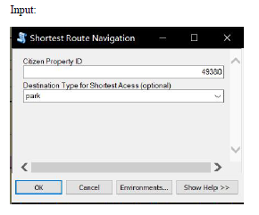
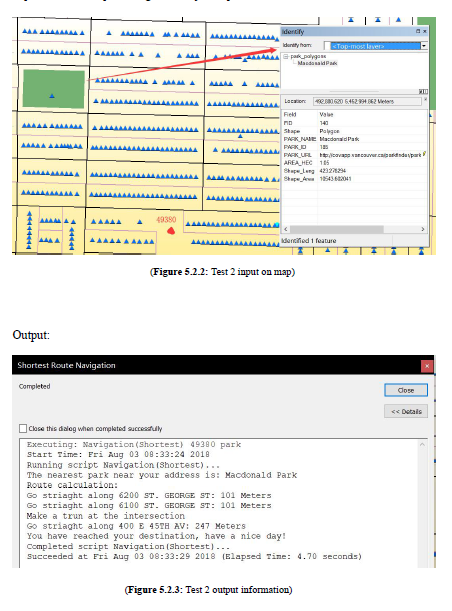
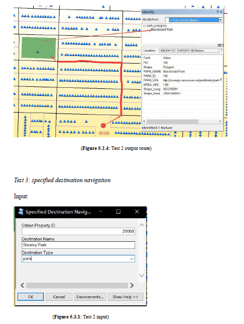
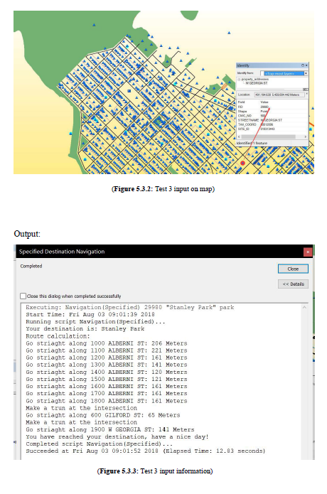
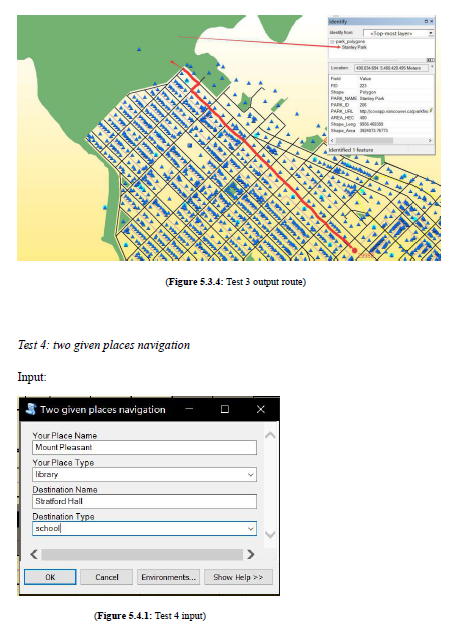
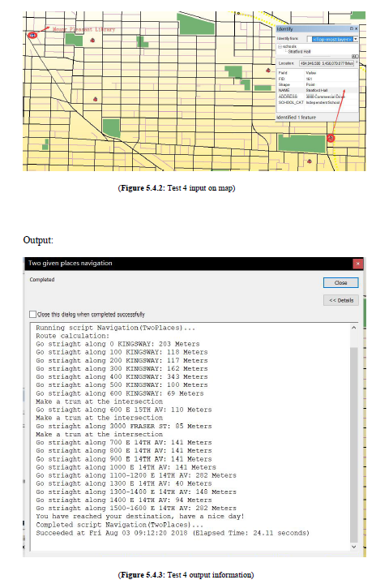

## Assumptions and Limitations

This toolbox is created to handle all navigation among Vancouver so it may take a long time for large areas route calculation. Due to the core mind is to make a graph among street intersections, once the covered area is bigger, it needs more time to deal with the created graph. A new method is to upgrade the shortest route calculation called arc-flag approach which is based on Dijkstra’s algorithm to accelerate the route calculation. It contains a preprocessing of data in graph to divide into different regions and gather whether an arc is on a shortest path into a given region(Möhring, 2007). So the combination of appropriate partitioning and two direction search can make route calculation more efficient. In addition, the toolbox only can provide shortest path for drivers because it is based on public streets. For users who walk, skate or cycle, the process area should include non public streets and lanes and more than one graph should be generated with various decisions between different types of roads.

## Conclusion and Future Work

The project provides route navigation from property addresses to nearest or specific schools, libraries and parks and also between two arbitrary given places among city of Vancouver. From attributes in different shape files, spatial data like XY coordinates of objects has been found to analyse and yield the toolbox. Also, the relationship between attributes in every shape file should be generated from object ID to its other attributes for getting access to all the information. From this project, I have gained knowledge in searching GIS data online, creating maps by ArcGIS, spatial data analysis, skills of Python Scripts programming especially in debugging public streets data sets where I found a digitizing error and it makes me understand GIS spatial data more clearly. In the future, I hope I could improve this navigation toolbox by adding lanes and non public street shape files to generate an advanced version of navigation toolbox both for drivers and pedestrians.

## Code

_Python solution demo: shortest route calculation_

```python

import arcpy
import math
import re
from arcpy import env
from collections import defaultdict
env.overwriteOutput = True
env.workspace = "C:/Users/CHAO/Desktop/GIS Project_Chao Zhang/city of vancouver.gdb"
#units = arcpy.Describe("park_polygons").spatialReference.linearUnitName
units = "meters"
input_id = arcpy.GetParameter(0)
input_type = arcpy.GetParameter(1)

# calculation of the distance
def dis(a,b):
  result = math.sqrt(a*a + b*b)
  return result

def getposition_citizen(id_num):
 fc = "property_addresses"
 cursor = arcpy.da.SearchCursor(fc,["SHAPE@XY","OID@"])
 for row in cursor:
  if row[1] == id_num:
   x,y = row[0]
 del row
 del cursor
 return x,y

def destination_info(type):
 if type == "park":
  return ("park_polygons","PARK_NAME")
 if type == "library":
  return ("libraries","NAME")
 if type == "school":
  return ("schools","NAME")

def location_distance_calc(c_x,c_y,fc,a_name):
 cursor = arcpy.da.SearchCursor(fc,["SHAPE@XY",a_name])
 s = 99**9
 for row in cursor:
  x,y = row[0]
  distance = dis(x-c_x,y-c_y)
  if distance<s:
   s = distance
   name = row[1]
   l_x = x
   l_y = y
 del row
 del cursor
 return name,l_x,l_y

def store_street_intersections():
 data = []
 for i in xrange(6970):
  data.append([])
  for j in xrange(3):
   data[i].append([])

 fc = "street_intersections"
 cursor = arcpy.da.SearchCursor(fc,["OID@","SHAPE@XY","XSTREET"])
 for row in cursor:
  num = row[0]
  x,y = row[1]
  data[num][0] = num
  data[num][1] = x
  data[num][2] = y
 del row
 del cursor
 return data

def get_max_and_min(x,y,park_x,park_y):
 if x>park_x:
  max_x = x
  min_x = park_x
 else:
  max_x = park_x
  min_x = x
 if y>park_y:
  max_y = y
  min_y = park_y
 else:
  max_y = park_y
  min_y = y
 return min_x,max_x,min_y,max_y

def get_region(start_x,end_x,start_y,end_y,storedata):  #select conjunctions
 data = []
 t = 0
 for i in xrange(6970):
  x = storedata[i][1]
  y = storedata[i][2]
  if x>start_x and x<end_x and y>start_y and y<end_y:
   data.append([])
   for j in xrange(3):
    data[t].append([])
   data[t][0] = i
   data[t][1] = x
   data[t][2] = y
   t+=1
 return data,t


def get_street(start_x,end_x,start_y,end_y,storedata):
 data = []
 t = 0
 fc = "public_streets"
 cursor = arcpy.da.SearchCursor(fc,["SHAPE@","SHAPE@XY","HBLOCK"])
 for row in cursor:
  x,y = row[1]
  if x>start_x and x<end_x and y>start_y and y<end_y:
   s = 0
   data.append([])
   data[t].append([])
   data[t][s] = row[2]
   s+=1
   for point in row[0].getPart(0):
    data[t].append([])
    data[t][s] = point.X,point.Y
    s+=1
   t+=1
 for i in xrange(len(data)-1):
  for j in xrange(i+1,len(data)):
   if data[i][0] == data[j][0]:
    add = data[j][1:len(data[j])]
    for k in xrange(len(add)):
     data[i].append(add[k])
    data[j][0] = "del"
 newdata = []
 for list in data:
  if list[0] != "del":
   newdata.append(list)
 return newdata,len(newdata)

def create_gragh(region,region_num,street):
 data = []
 t = 0
 for i in xrange(region_num-1):
  for j in xrange(i+1,region_num):
   for list in street:
    if (region[i][1],region[i][2]) in list and (region[j][1],region[j][2]) in list:
     data.append([])
     for k in xrange(3):
      data[t].append([])
     data[t][0] = region[i][0]
     data[t][1] = region[j][0]
     data[t][2] = dis (region[i][1]-region[j][1],region[i][2]-region[j][2])
     t+=1
 return data

#dijsktra
class Graph():
    def __init__(self):
        """
        self.edges is a dict of all possible next nodes
        self.weights has all the weights between two nodes,
        with the two nodes as a tuple as the key
        e.g. {('X', 'A'): 7, ('X', 'B'): 2, ...}
        """
        self.edges = defaultdict(list)
        self.weights = {}
    def add_edge(self, from_node, to_node, weight):
        # Note: assumes edges are bi-directional
        self.edges[from_node].append(to_node)
        self.edges[to_node].append(from_node)
        self.weights[(from_node, to_node)] = weight
        self.weights[(to_node, from_node)] = weight

def dijsktra(graph, initial, end):
    # shortest paths is a dict of nodes
    # whose value is a tuple of (previous node, weight)
    shortest_paths = {initial: (None, 0)}
    current_node = initial
    visited = set()
    while current_node != end:
        visited.add(current_node)
        destinations = graph.edges[current_node]
        weight_to_current_node = shortest_paths[current_node][1]

        for next_node in destinations:
            weight = graph.weights[(current_node, next_node)] + weight_to_current_node
            if next_node not in shortest_paths:
                shortest_paths[next_node] = (current_node, weight)
            else:
                current_shortest_weight = shortest_paths[next_node][1]
                if current_shortest_weight > weight:
                    shortest_paths[next_node] = (current_node, weight)
        next_destinations = {node: shortest_paths[node] for node in shortest_paths if node not in visited}
        if not next_destinations:
            return "Route Not Possible"
        # next node is the destination with the lowest weight
        current_node = min(next_destinations, key=lambda k: next_destinations[k][1])
    # Work back through destinations in shortest path
    path = []
    while current_node is not None:
        path.append(current_node)
        next_node = shortest_paths[current_node][0]
        current_node = next_node
    # Reverse path
    path = path[::-1]
    return path

def shortest(region,x,y,l_x,l_y):
 start = 99**9
 end = 99**9
 for list in region:
  num = list[0]
  xxx = list[1]
  yyy = list[2]
  if dis(x-xxx,y-yyy)<start:
   start = dis(x-xxx,y-yyy)
   start_num = num
  if dis(xxx-l_x,yyy-l_y)<end:
   end = dis(xxx-l_x,yyy-l_y)
   end_num = num
 return start_num,end_num

def navigation(path,region,street,type,l_name):
 arcpy.AddMessage ("The nearest {0} near your address is: {1}".format(type,l_name))
 arcpy.AddMessage ("Route calculation:")
 origin = []
 draw = []
 for count in xrange(len(path)-1):
  num1 = path[count]
  num2 = path[count+1]
  for list in region:
   if list[0] == num1:
    x1 = list[1]
    y1 = list[2]
   if list[0] == num2:
    x2 = list[1]
    y2 = list[2]
  for list in street:
   if (x1,y1) in list and (x2,y2) in list:
    mark = list[0]
    distance = int(round(dis (x1-x2,y1-y2)))
    pointA = (x1,y1)
    draw.append(pointA)
    pointB = (x2,y2)
    draw.append(pointB)
  turn = re.split(' ',mark)
  turn.pop(0)
  if count == 0:
   origin = turn
  if turn != origin:
   arcpy.AddMessage ("Make a trun at the intersection")
   origin = turn
  arcpy.AddMessage ("Go striaght along {0}: {1} {2}s".format(mark,distance,units))
 arcpy.AddMessage ("You have reached your destination, have a nice day!")
 #draw the output
 newfc = "navigation_output"
 cursor = arcpy.da.InsertCursor(newfc, ["SHAPE@"])
 array = arcpy.Array()
 for data in draw:
  x,y = data
  array.add(arcpy.Point(x,y))
 cursor.insertRow([arcpy.Polyline(array)])
 del cursor

# main
citizenID =  input_id
destination_type = input_type
filename,attribute_name = destination_info(destination_type)
p_x,p_y = getposition_citizen(citizenID)
location_name,l_x,l_y = location_distance_calc(p_x,p_y,filename,attribute_name)
min_x,max_x,min_y,max_y = get_max_and_min(p_x,p_y,l_x,l_y)
storedata = store_street_intersections()
region,region_num = get_region(min_x-600,max_x+600,min_y-600,max_y+600,storedata)
street,street_num = get_street(min_x-600,max_x+600,min_y-600,max_y+600,storedata)
edges = create_gragh(region,region_num,street)
graph = Graph()
for edge in edges:
    graph.add_edge(*edge)

start,end = shortest(region,p_x,p_y,l_x,l_y)
path = dijsktra(graph,start,end)
navigation(path,region,street,destination_type,location_name)

```
